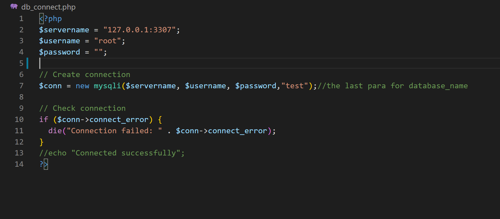

# Search_bar_comp353
  <h1>A. Tech used: PHP,javascript,css,html</h1>
    
<strong>Note: </strong>The code is tested on Xampp sever. For running the code, please run it on xampp

     
    <h1>B. Instruction on running the code</h1>
    
<strong>1.Initialize the database</strong> 
        I used mysql workbench for creating table. Information for the sever including IP, username and password used are shown in the picture below.
        
        The code for creating and inserting table is in <strong>database_create_and_insert.sql</strong>  
        <strong>2. Setup Xampp</strong> 
        Please copy the whole folder/repository into your xampp repository.
        In my case: <strong>C:\xampp\htdocs and my folder name is "ken_project2".</strong>
        To run the code, the file should be visible at: <strong>"http://localhost/ken_project2/"</strong>
    

